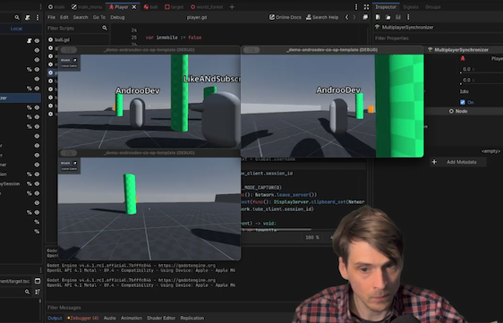
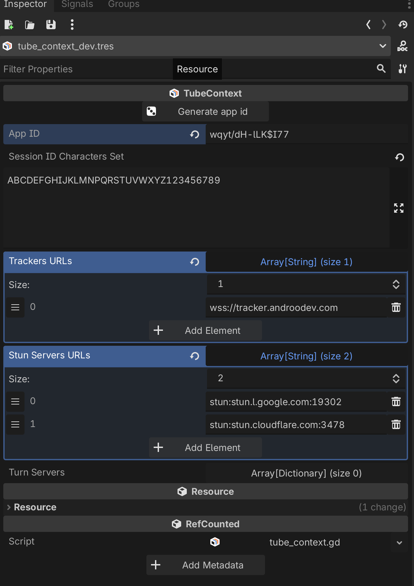
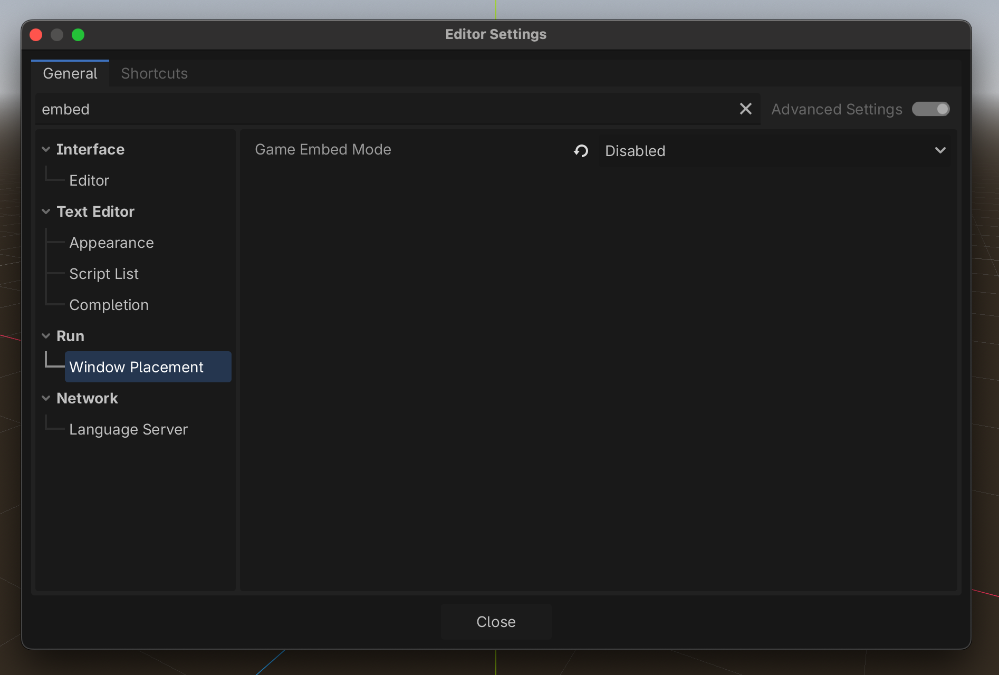
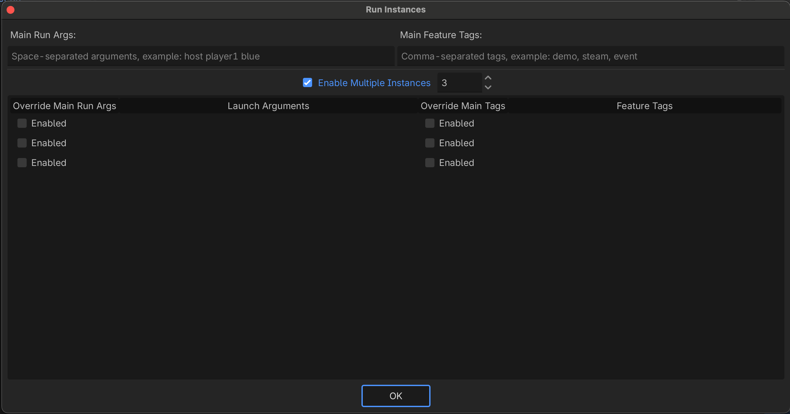

# AndrooDev Friendslop Co-Op Tutorial PART 2

The complete tutorial project from the [Godot Multiplayer Friendslop Co-Op Tutorial Part 2 on YouTube](https://www.youtube.com/watch?v=wgIqB6JNcro). Uses WebRTC via the Tube https://github.com/koopmyers/tube to make it easy to make a true peer-to-peer and play with your friends. See [Part 1 on YouTube here](https://youtu.be/NvG08tA06xQ) to build up your multiplayer fundamentals like syncing and spawning.

### Update: Use the new tracker!

Add this tracker to your Tracker URLs in `tube_context.tres`. See bottom for [example image](#example-images)!

```
wss://tracker.androodev.com
```

### Update: Try the TURN Relay

If you are having issues connecting on a restrictive network or VPN, you can try using the TURN relay as laid out in this pull request:
https://github.com/jonandrewdavis/AndrooDev-Friendslop-Co-Op-Tutorial-Part-2/pull/2. Toggle on in the demo to see if it helps.

### Links

|             Twitch              |              Youtube               |            Play now on Itch (Send to a friend!)             |
| :-----------------------------: | :--------------------------------: | :---------------------------------------------------------: |
| https://www.twitch.tv/androodev | https://www.youtube.com/@AndrooDev | https://androodev.itch.io/androodev-friendslop-co-op-sample |



## Local Development:

#### NOTE: You may need to allow WebRTC extension in your security settings when the project starts on local! See the official https://github.com/godotengine/webrtc-native package for more information.

- Clone this project
- Import in Godot 4.6
- You may need to disable Game Embed.
  - Open Godot menu -> Select Editor Settings
  - Search Embed
  - Window Placement
  - Game Embed Mode: Disabled
- Select Debug -> Select Customize Run Instances
  - Set 3 instances
- Play
  - Launched windows should tile
- Create session (Copies Session ID)
- Join on client (Paste session)
- Join on client (Paste session)

## Controls

- Tab to open menu
- WASD to Move
- Mouse to look
- Left Click to shoot ball

## Example Images

| App Context Example (tracker.androodev.com) |          Customize Run Instances          |              Game Embed Mode: Disabled              |
| :-----------------------------------------: | :---------------------------------------: | :-------------------------------------------------: |
|                 |  |  |
